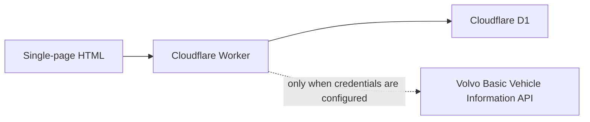

# Volvo Fleet Intelligence

An independent portfolio project. Volvo does not endorse it, and the public demo does not contain a real Volvo fleet.

The browser never calls Volvo. Credentials, if they are ever added, stay in Worker secrets.

## How it got here

**2023.** NC A&T Hackathon. A Python/Tkinter vehicle lookup, `main.py`, placed 2nd. That submission is preserved on the `master` branch.

**2026.** The `deploy` branch is a cloud fleet-intelligence demo:

- Cloudflare Workers REST API
- Cloudflare D1
- Fleet overview, vehicle detail, and rule-based fleet health
- Maintenance and a placeholder parts catalog
- Simulated historical readings
- A geographic demo map of the North Carolina Piedmont
- Electrification estimates and a mission comparison
- A Volvo-compatible adapter that stays off until credentials exist

## What the numbers mean

Demo fleet telemetry is simulated. VINs look like `SIM-VT-0101` and are not Volvo VINs. Truck specifications and operating costs are authoritative only when a source is shown. The Electrification Lab and Mission Planner are labeled **ESTIMATE**. They are not measured fleet performance.

Volvo Basic Vehicle Information integration needs valid vehicle authorization and API credentials (`VOLVO_CLIENT_ID`, `VOLVO_CLIENT_SECRET`, `VOLVO_API_BASE_URL`, `VOLVO_TOKEN_URL`). No real Volvo fleet data is bundled in the public demo. The scheduled ingest exits when those secrets are missing. That API is a rolling history, not second-by-second telemetry.

## Run the 2023 desktop app

`main.py` is the original hackathon lookup. It is separate from the web app.

1. Install Python.
2. Run `python main.py`.

## Web app

The page is `index.html` at the repo root, duplicated in `deploy/index.html`. Both files must stay identical. It calls `window.VTDB_API` and falls back to built-in demo data if that API is unreachable.

The Worker lives in `deploy/api`. Live database changes go in `deploy/api/migrations/` and must not drop existing tables. `deploy/api/schema.sql` is the original bootstrap and is not safe to replay on the live database.

Public visitors can read the API. Creating, updating, or deleting rows requires an `ADMIN_TOKEN` Worker secret sent as `X-Admin-Token`.

## API

Existing lookups still work: `GET /api/trucks`, `GET /api/trucks/:id`, `GET /api/trucks/:id/:field`, `GET /api/service`, `GET /api/parts`.

Normalized routes: `GET /api/vehicles`, `GET /api/vehicles/:id`, `GET /api/vehicles/:id/readings`, `GET /api/vehicles/:id/health`, `GET /api/vehicles/:id/service`, `GET /api/fleet/health`, `GET /api/fleet/analytics`, `GET /api/assumptions`, `GET /api/fleet/mission`.

A future Fleet Analyst should call these structured routes and should not invent truck facts.

## License

MIT. See `LICENSE`.
